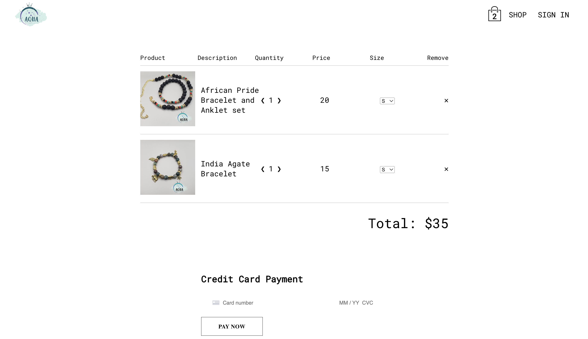
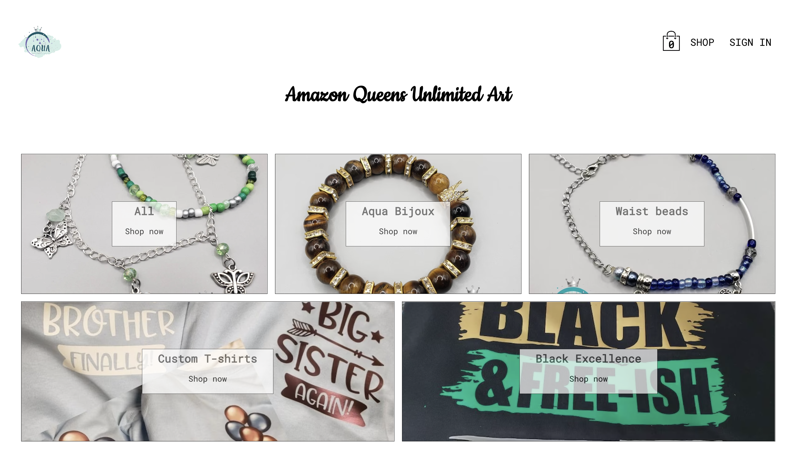

# **Aqua Crafts Store**

## Table of Contents

- [Description](#description)
- [Deployed Web App](#deployed-web-app)
- [User Story](#user-story)
- [Getting Started](#getting-started)
- [Technologies](#technologies)
- [Future Improvements](#future-improvements)

## Description

---

The Aqua Crafts Store is a website that sells anklets, necklaces, bracelets, and more! This is a React app that integrates with firebase, firestore and the stripe api.

## Deployed Web App

---

Deployed Website: https://main--aquacrafts-store.netlify.app/

## User Story

---

As a small business owner I want an online store where I can sell my handmade products. I want customers to be able to browse through my selection of items and securely send payments.

## Getting Started

---

Navigate throughout the page. Add desired items to the cart. Click the shopping bag to view items in cart and go to checkout. In checkout, adjust quantity of items and pay with credit card at the bottom of the page. 

## Technologies

---

- React
- Node.js
- Firebase
- FireStore
- Stripe
- Sass
- Styled components
- CSS
- Google Fonts

## Future Improvements

---

For future improvements I will include...

- Add a contact method 
- Create confirmation emails that send to customer and owner
- Add show pages for each item
- Add input sections for customizable items
- Add a searchbar
- Add setting options for users accounts

